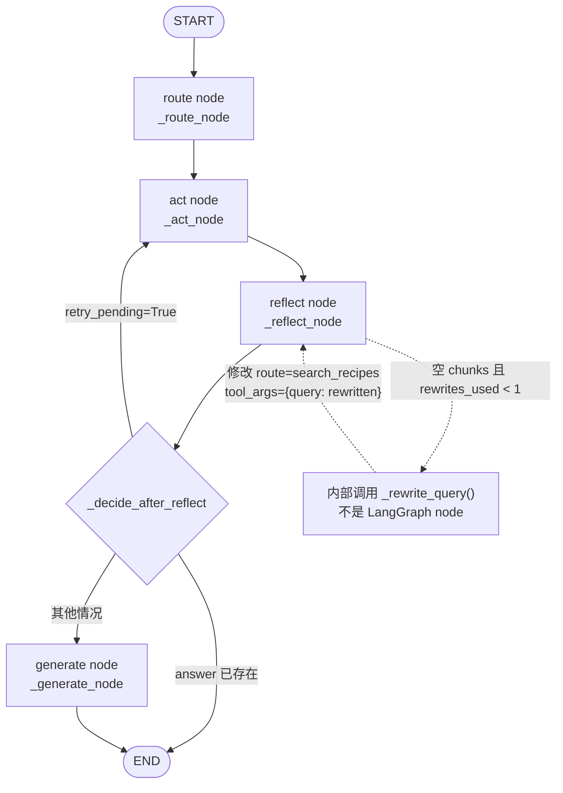

# Agent 模式 Query 生命周期

本文基于当前仓库真实源码，完整梳理一次 Agent 模式 Query 从 API 入口、LangGraph 控制流、工具执行、Retrieval、Parent 回溯、Generation、Trace 到 API 返回的生命周期。

## 核心结论先行

当前真实 LangGraph 节点只有四个：

```text
route
act
reflect
generate
```

源码没有注册名为 `rewrite` 的 LangGraph node。

`rewrite` 是 `_reflect_node()` 内部调用 `_rewrite_query()` 完成的一次普通函数操作。改写完成后，`reflect` 修改 State 中的 `route` 和 `tool_args`，再由条件边把控制流送回 `act`。

判断依据是 `RecipeAgent._build_graph()` 中真实执行的：

```python
graph.add_node("route", self._route_node)
graph.add_node("act", self._act_node)
graph.add_node("reflect", self._reflect_node)
graph.add_node("generate", self._generate_node)
```

文件顶部注释中出现的 `rewrite` 只是概念流程描述，不是一个注册到 `StateGraph` 的独立节点。

---

## 一、Agent 从哪里被调用

### 1. FastAPI 同步入口

**文件**

`api/app.py`

**函数**

`create_app()` 内的 `ask()`

请求：

```http
POST /api/ask
```

请求体：

```json
{
  "query": "红烧肉怎么做",
  "pipeline": "agent",
  "session_id": "session-001"
}
```

Pydantic 数据结构：

```python
AskRequest(
    query: str,
    role: str | None,
    pipeline: Literal["classic", "agent"],
    session_id: str | None,
)
```

API 完成：

```text
get_rag()
→ get_principal()
→ authenticate()
→ effective_role()
→ _new_query_id()
```

Agent 分支：

```python
if body.pipeline == "agent":
    result = rag.ask_agent(
        body.query,
        role=role,
        query_id=query_id,
        history=load_history(request, body.session_id),
    )
```

如果传入 `session_id`，API 会把该会话最近保存的历史传给 Agent。

### 2. FastAPI 流式入口

**文件**

`api/app.py`

**函数**

`ask_stream()`

Agent 分支仍然调用同步的：

```python
rag.ask_agent(...)
```

完成后将整个答案作为一个 SSE `token` 事件发送：

```python
yield sse({"type": "token", "content": answer})
```

因此当前 Agent SSE 路径不是 LLM token 级流式生成，而是完整执行 Agent 后一次性发送答案。

### 3. CLI 入口

**文件**

`main.py`

**函数**

- `main()` 的 `--agent` 分支
- `RecipeRAGSystem.run_interactive(agent_mode=True)`

最终都调用：

```python
RecipeRAGSystem.ask_agent()
```

---

## 二、进入 RecipeRAGSystem

### 4. 创建 Agent QueryTrace

**文件**

- `main.py`
- `rag_modules/observability.py`

**函数 / 类**

- `RecipeRAGSystem.ask_agent()`
- `QueryTrace`

创建：

```python
trace = QueryTrace(
    question,
    role=role,
    pipeline="agent",
    query_id=query_id,
)
```

输入：

```python
question: str
role: str
query_id: str | None
history: list[dict[str, Any]] | None
```

下一步：

```python
result = self._get_agent().invoke(
    question,
    role=role,
    history=history,
)
```

### 5. Agent 对象被懒加载

**文件**

`main.py`

**函数**

```python
RecipeRAGSystem._get_agent()
```

如果 `self._agent is None`，创建：

```python
self._agent = RecipeAgent(
    self.retrieval_module,
    self.data_module,
    self.generation_module,
    top_k=self.config.top_k,
    visibility_expr_builder=self._visibility_expr_for_role,
)
```

注入给 Agent 的都是现有模块实例：

```text
RetrievalOptimizationModule
DataPreparationModule
GenerationIntegrationModule
角色到 visibility 表达式的构造函数
```

因此 Agent 没有重新构建索引，也没有创建另一套 Retriever。

`RecipeAgent.__init__()` 随后执行：

```python
self.tools = build_agent_tools(self.domain)
self.graph = self._build_graph()
```

---

## 三、AgentState 数据结构

**文件**

`rag_modules/agentic_rag.py`

**类型**

```python
class AgentState(TypedDict, total=False)
```

主要字段：

| 字段 | 类型 | 含义 |
|---|---|---|
| `question` | `str` | 当前用户原始问题 |
| `role` | `str` | 用户角色 |
| `history` | `list[dict]` | 最近对话历史 |
| `route` | `str` | LLM 选择的工具名 |
| `tool_args` | `dict[str, Any]` | 工具调用参数 |
| `chunks` | `list[Document]` | Retrieval 返回的 Child Chunk |
| `parents` | `list[Document]` | 回溯后的 Parent Document |
| `image_paths` | `list[str]` | 命中图片块对应的路径 |
| `answer` | `str` | 最终答案或提前生成的直接回答 |
| `rewrites_used` | `int` | 已使用的改写次数 |
| `retry_pending` | `bool` | 是否需要回到 `act` 重试 |
| `error` | `str | None` | 当前降级或错误信息 |
| `events` | `list[dict]` | Agent 内部审计事件 |

`messages` 字段虽然在 `AgentState` 中声明并带有 `add_messages` 注解，但当前 `invoke()` 初始 State 没有设置它，四个节点也没有使用它。当前多轮能力实际通过 `history` 字段实现。

---

## 四、真实 StateGraph 构建

### 6. 真实 node 注册

**文件**

`rag_modules/agentic_rag.py`

**函数**

```python
RecipeAgent._build_graph()
```

真实注册代码：

```python
graph = StateGraph(AgentState)
graph.add_node("route", self._route_node)
graph.add_node("act", self._act_node)
graph.add_node("reflect", self._reflect_node)
graph.add_node("generate", self._generate_node)
```

真实普通边：

```python
graph.add_edge(START, "route")
graph.add_edge("route", "act")
graph.add_edge("act", "reflect")
graph.add_edge("generate", END)
```

真实条件边：

```python
graph.add_conditional_edges(
    "reflect",
    self._decide_after_reflect,
    {
        "act": "act",
        "generate": "generate",
        END: END,
    },
)
```

最后：

```python
return graph.compile()
```

### 7. START 到 END 的真实控制流

所有请求都会先经过：

```text
START → route → act → reflect
```

到 `reflect` 后才发生分支。

#### 路径一：正常检索成功

```text
START
→ route
→ act：得到 chunks 和 parents
→ reflect：不改写
→ generate
→ END
```

#### 路径二：首次检索为空，改写后重试

```text
START
→ route
→ act：chunks=[]
→ reflect：内部执行 rewrite，设置 retry_pending=True
→ act：使用改写 Query 重试
→ reflect：不再改写
→ generate
→ END
```

#### 路径三：`direct_answer`

```text
START
→ route：direct_answer
→ act：直接设置 answer
→ reflect：发现 answer 已存在
→ END
```

`generate` 节点不会执行。

#### 路径四：Retrieval 整体不可用

```text
START
→ route
→ act：工具失败，默认检索也失败
→ act 内部设置离线 answer
→ reflect：发现 answer 已存在
→ END
```

#### 路径五：改写后仍无结果

```text
START
→ route
→ act：空结果
→ reflect：改写
→ act：再次为空
→ reflect：改写次数耗尽，记录 no_results
→ generate：返回固定无结果话术
→ END
```

---

## 五、route 节点

### 8. route 的输入

**函数**

```python
RecipeAgent._route_node(state)
```

主要输入：

```python
state["question"]: str
state.get("history"): list[dict] | None
```

`_route_node()` 调用：

```python
self._route_llm_call(
    question,
    history=state.get("history"),
)
```

### 9. route 如何调用 LLM

`_route_llm_call()` 构造消息：

```python
messages = [
    {"role": "system", "content": self.domain.agent_router_prompt},
    *self._history_messages(history),
    {"role": "user", "content": question},
]
```

`_history_messages()` 最多取最近 6 条 user/assistant 消息。

真正调用：

```python
message = self._llm().bind_tools(self.tools).invoke(messages)
```

这里使用的是 `GenerationIntegrationModule.llm`，不是 Agent 自己创建的新 LLM。

### 10. route 的输出

如果模型返回工具调用，取第一个：

```python
{
    "route": call["name"],
    "tool_args": dict(call["args"]),
}
```

写入 State：

```python
state["route"] = decision["route"]
state["tool_args"] = decision["tool_args"]
```

并追加事件：

```python
_event(
    "route",
    route=decision["route"],
    args=decision["tool_args"],
)
```

如果 LLM 没有工具调用但返回文本：

```python
route = "direct_answer"
tool_args = {"answer": content}
```

如果路由 LLM 抛出异常：

```python
route = "search_recipes"
tool_args = {"query": question}
state["error"] = f"route_fallback: {exc}"
```

即路由失败时降级为默认菜谱检索。

---

## 六、当前真实 tools

### 11. Tool schema 在哪里定义

**文件**

`rag_modules/agentic_rag.py`

**函数**

```python
build_agent_tools(domain)
```

它返回：

```python
list[dict[str, Any]]
```

这些是提供给 LLM function calling 的工具 Schema，不是使用 `@tool` 装饰器创建的可直接执行函数。

LLM 只负责返回工具名和参数，真正执行由 `_act_node()` 中的 Python 条件分支完成。

### 12. 四个工具的真实职责

| 工具名 | 输入参数 | `_act_node()` 中的真实行为 |
|---|---|---|
| `search_recipes` | 必需 `query`；可选 `category`、`difficulty` | 调用 `_search_recipes()`，最终进入 `metadata_filtered_search()` |
| `search_images` | 必需 `query` | 强制添加 `{"modality": "image"}` 后调用 `metadata_filtered_search()` |
| `list_by_metadata` | 可选 `category`、`difficulty` | 以 metadata 值构造检索 Query，使用结构化过滤，并至少请求 5 个结果 |
| `direct_answer` | 必需 `answer` | 直接把 LLM 提供的文本写入 `state["answer"]`，跳过 Retrieval 和最终 Generation |

#### `search_recipes`

执行：

```python
self._search_recipes(
    args.get("query", question),
    role,
    category=args.get("category"),
    difficulty=args.get("difficulty"),
)
```

`_search_recipes()` 内部：

```python
self.retrieval_module.metadata_filtered_search(
    query,
    clean_filters,
    top_k=self.top_k,
    extra_expr=self._visibility_expr(role),
)
```

#### `search_images`

执行：

```python
self.retrieval_module.metadata_filtered_search(
    args.get("query", question),
    {"modality": "image"},
    top_k=self.top_k,
    extra_expr=self._visibility_expr(role),
)
```

它仍然使用文本 Query 检索图片 caption Child Chunk。

#### `list_by_metadata`

执行：

```python
filters = {k: v for k, v in args.items() if v}
query = " ".join(str(v) for v in filters.values()) or "家常菜谱推荐"

self.retrieval_module.metadata_filtered_search(
    query,
    filters,
    top_k=max(self.top_k, 5),
    extra_expr=self._visibility_expr(role),
)
```

#### `direct_answer`

执行：

```python
state["answer"] = (
    str(args.get("answer", "")).strip()
    or self.domain.direct_answer_default
)
```

然后 `act` 返回；控制流仍会经过 `reflect`，但 `reflect` 发现已有 `answer` 后会走 `END`。

---

## 七、act 节点

### 13. act 的输入与初始化

**函数**

```python
RecipeAgent._act_node(state)
```

主要输入：

```python
route = state.get("route", "search_recipes")
args = state.get("tool_args", {})
role = state.get("role", "user")
question = state["question"]
```

每次进入 `act` 都显式重置：

```python
state["retry_pending"] = False
state["chunks"] = []
state["parents"] = []
state["image_paths"] = []
```

这是为了确保重试时不会残留上一次 State 中的结果。

### 14. act 如何分发工具

`_act_node()` 通过普通 `if/elif/else` 执行工具：

```python
if route == "direct_answer":
    ...
elif route == "search_images":
    ...
elif route == "list_by_metadata":
    ...
else:
    # search_recipes 或未知 route
    ...
```

这意味着 tools 是 LLM 可见的结构化选择面，而工具执行仍是确定性 Python 代码。

### 15. 权限约束仍位于 LLM 外部

每个检索工具都会调用：

```python
self._visibility_expr(role)
```

它进一步调用从 `RecipeRAGSystem` 注入的：

```python
RecipeRAGSystem._visibility_expr_for_role()
```

因此 LLM 不能通过工具参数自行决定是否访问 internal 内容。

### 16. 工具失败时的降级

如果选中的工具执行失败：

```python
state["error"] = f"tool_fallback({route}): {exc}"
```

并尝试默认检索：

```python
chunks = self.retrieval_module.hybrid_search(
    question,
    top_k=self.top_k,
    expr=self._visibility_expr(role),
)
```

这里：

- 使用原始 `question`。
- 不再保留工具原本的 category、difficulty 或 image modality 过滤。
- 仍保留角色 visibility 表达式。

如果默认 Retrieval 也失败：

```python
state["answer"] = self._offline_answer(question)
state["error"] = "retrieval_unavailable"
```

然后后续从 `reflect` 直接进入 `END`。

---

## 八、Agent 是否复用原 Retrieval stack

### 17. 真实答案：完全复用 RetrievalOptimizationModule

Agent 构造时直接接收：

```python
retrieval_module: RetrievalOptimizationModule
```

它与 Classic 模式使用的是 `RecipeRAGSystem.retrieval_module` 同一个实例。

调用关系：

```text
RecipeAgent._act_node()
→ RetrievalOptimizationModule.metadata_filtered_search()
   或 RetrievalOptimizationModule.hybrid_search()
→ MilvusVectorStore / FaissBackend
→ Dense + Sparse + Fusion
→ 可选 Reranker
```

Agent 没有替换：

- Embedding 模型
- Dense Retrieval
- Sparse Retrieval
- 融合逻辑
- Reranker
- Milvus collection
- FAISS index
- metadata filter 实现
- visibility filter 实现

Agent 改变的是“何时调用哪种检索入口、带什么参数、空结果后是否重试”，不是底层 Retrieval 算法。

---

## 九、Child Chunk → Parent Document

### 18. 回溯发生在 act 节点内部

**文件**

`rag_modules/agentic_rag.py`

**函数**

```python
RecipeAgent._act_node()
```

Retrieval 返回：

```python
chunks: list[Document]
```

这些是 Child Chunk。

随后：

```python
parents = (
    self.data_module.get_parent_documents(chunks)
    if chunks
    else []
)
```

真正执行回溯的函数位于：

```python
DataPreparationModule.get_parent_documents()
```

它根据 Child metadata 中的 `parent_id`：

1. 查找完整 Parent Document。
2. 按命中 Child 数量统计 Parent 相关度。
3. Parent 去重。
4. 按命中数量和首次出现位置排序。

写回 State：

```python
state["chunks"] = chunks
state["parents"] = parents
```

同时收集图片路径：

```python
state["image_paths"] = image_paths[:6]
```

最后记录：

```python
_event(
    "act",
    route=route,
    hits=len(chunks),
    parents=len(parents),
)
```

---

## 十、reflect 节点与 Rewrite/Retry

### 19. reflect 的输入

**函数**

```python
RecipeAgent._reflect_node(state)
```

主要检查：

```python
state.get("answer")
state.get("chunks")
state.get("parents")
state.get("rewrites_used", 0)
```

### 20. 哪些情况不会 Rewrite

#### 已经存在 answer

```python
if state.get("answer") is not None:
    return state
```

包括：

- `direct_answer`
- Retrieval 完全不可用后的离线答案

#### 已有 chunks

Rewrite 条件要求：

```python
not state.get("chunks")
```

因此只要 Retrieval 返回至少一个 Child，就不会改写。

即使存在 Child 但无法映射到 Parent，也不会 Rewrite；这种情况会记录 `no_results`，随后进入 `generate` 并返回无结果话术。

### 21. 触发 Rewrite 的真实条件

必须同时满足：

```python
not state.get("chunks")
and rewrites_used < MAX_REWRITES
```

即：

```text
检索结果为空
并且
尚未用完重写机会
```

### 22. Rewrite 在 reflect 内部执行

调用：

```python
rewritten = self._rewrite_query(
    state["question"],
    history=state.get("history"),
)
```

`_rewrite_query()` 会组合：

- 原始问题
- 最近两条对话背景
- 要求加入菜品、食材或烹饪方式关键词的 Prompt

真正调用：

```python
self._llm().invoke(prompt)
```

返回：

```python
rewritten: str
```

随后直接修改 State：

```python
state["rewrites_used"] = rewrites_used + 1
state["route"] = "search_recipes"
state["tool_args"] = {"query": rewritten}
state["retry_pending"] = True
```

所以无论首次 route 是：

```text
search_images
list_by_metadata
search_recipes
```

空结果后的重试都会被统一改成：

```text
route = search_recipes
```

不会保持原来的图片或 metadata 工具。

### 23. Rewrite 失败

如果 LLM 改写失败：

```python
state["error"] = f"rewrite_failed: {exc}"
state["rewrites_used"] = MAX_REWRITES
```

不会再重试，条件边会将流程送往 `generate`，最终在没有 Parent 时返回固定无结果答案。

### 24. 最多允许重试多少次

源码常量：

```python
MAX_REWRITES = 1
```

因此：

- 原始工具检索最多执行一次。
- 空结果后最多改写一次。
- 改写后的检索最多再执行一次。
- 不会发生第二次 Query Rewrite。

整个图调用还设置：

```python
config={"recursion_limit": 8}
```

它是 LangGraph 的额外递归上限；业务层真正的 Rewrite 次数限制仍是 `MAX_REWRITES=1`。

---

## 十一、reflect 后的条件路由

### 25. `_decide_after_reflect()`

真实判断顺序：

```python
if state.get("answer") is not None:
    return END

if state.get("retry_pending"):
    return "act"

if not state.get("chunks"):
    return "generate"

return "generate"
```

可以压缩为：

```text
已有 answer       → END
需要重试          → act
其他所有情况      → generate
```

后两个判断最终都返回 `generate`。当前实现保留显式空结果判断，便于表达语义，但控制流目标相同。

---

## 十二、generate 节点

### 26. generate 在哪里发生

**文件**

`rag_modules/agentic_rag.py`

**函数**

```python
RecipeAgent._generate_node(state)
```

首先检查：

```python
if state.get("answer") is not None:
    return state
```

通常已有 answer 的路径已由 `reflect` 直接送往 `END`，这层检查属于防御性保护。

### 27. 无 Parent 时不调用生成 LLM

```python
parents = state.get("parents", [])

if not parents:
    state["answer"] = self.domain.agent_no_results
    return state
```

这包括：

- 原始检索为空，改写后仍为空。
- Rewrite 失败。
- 有 Chunk 但无法映射 Parent。

### 28. 多轮历史如何进入 Generation

Agent 不直接把历史作为单独 Chat Message 传给最终 Generation，而是调用：

```python
question = self._history_prefix(state.get("history")) + state["question"]
```

`_history_prefix()` 最多取最近 4 条历史，格式化为文本前缀：

```text
（对话历史，供理解指代用，回答只针对当前问题）
用户: ...
助手: ...

当前问题: 当前用户问题
```

### 29. 真正的 Generation 调用

有 Parent 时：

```python
state["answer"] = self.generation_module.generate_basic_answer(
    question,
    parents,
    image_paths=state.get("image_paths"),
)
```

Agent 的所有检索工具最终统一使用：

```python
GenerationIntegrationModule.generate_basic_answer()
```

它不会像 Classic 一样再按 `detail/general` 选择不同 Generation 方法，也不会调用 `generate_list_answer()`。

`generate_basic_answer()` 内部完成：

```text
Parent Documents
→ _build_context()
→ basic_answer_prompt
→ LLM chain.invoke()
→ StrOutputParser
→ format_citations()
```

### 30. Generation 失败时降级

如果最终 LLM 失败：

```python
state["answer"] = self._offline_answer(question, parents)
state["error"] = f"generate_fallback: {exc}"
```

离线答案只列出命中的 Parent 菜名，不调用 LLM。

并记录：

```python
_event("generate_fallback", error=str(exc))
```

---

## 十三、Graph 调用结束与 Trace

### 31. `RecipeAgent.invoke()`

初始 State：

```python
initial: AgentState = {
    "question": question,
    "role": role,
    "history": history or [],
    "rewrites_used": 0,
    "events": [],
}
```

执行图：

```python
result = self.graph.invoke(
    initial,
    config={"recursion_limit": 8},
)
```

输出：

```python
result: dict[str, Any]
```

它包含最终 `AgentState` 的字段，例如：

```python
{
    "question": str,
    "route": str,
    "tool_args": dict,
    "chunks": list[Document],
    "parents": list[Document],
    "image_paths": list[str],
    "answer": str,
    "rewrites_used": int,
    "events": list[dict],
    "error": str | None,
}
```

### 32. `RecipeRAGSystem.ask_agent()` 完成 QueryTrace

Graph 返回后：

```python
trace.events.extend(result.get("events", []))
```

追加汇总事件：

```python
trace.event(
    "summary",
    route=result.get("route"),
    hits=len(result.get("chunks", [])),
    rewrites=result.get("rewrites_used", 0),
)
```

结束：

```python
trace.finish(
    answer=result.get("answer"),
    error=result.get("error"),
)
```

随后：

```python
result["query_id"] = trace.query_id
return result
```

如果 Graph 整体抛出未处理异常：

```python
trace.event("pipeline_error", error=str(exc))
trace.finish(error=exc)
raise
```

与 Classic 不同，`ask_agent()` 会把异常重新抛给 API，API 再转换为 HTTP 500。

---

## 十四、最终返回 API

### 33. 会话历史保存

**文件**

`api/app.py`

Graph 成功后：

```python
save_turn(
    request,
    body.session_id,
    body.query,
    str(result.get("answer", "")),
)
```

只在提供 `session_id` 时保存。

保存：

```python
{"role": "user", "content": question}
{"role": "assistant", "content": answer[:400]}
```

每个会话只保留最近 6 条消息，也就是约 3 轮 user/assistant 对话。

### 34. hits 与 citations 结构化输出

API 从 Child Chunk 中提取：

```python
hits = [
    chunk.metadata.get("dish_name")
    for chunk in result.get("chunks", [])
]
```

并去重。

API 从 Parent Document 中提取：

```python
citations = [
    "菜名（source_path）"
]
```

这与答案字符串末尾由 `format_citations()` 追加的来源附录形成双层来源输出。

### 35. AskResponse

```python
return AskResponse(
    query_id=query_id,
    answer=str(result.get("answer", "")),
    pipeline="agent",
    route=result.get("route"),
    hits=list(dict.fromkeys(hits)),
    citations=citations,
    error=result.get("error"),
)
```

与 Classic 相比，Agent API 会额外返回：

```text
route
hits
citations
error
```

---

## A. 真实 LangGraph 流程图



真实注册节点：

```text
route
act
reflect
generate
```

没有注册：

```text
rewrite node
tool node
parent node
rerank node
```

这些能力分别作为普通函数操作发生在现有节点内部。

### 主要路径摘要

```text
正常成功：
START → route → act → reflect → generate → END

空结果重试：
START → route → act → reflect[内部 rewrite]
      → act → reflect → generate → END

直接回答：
START → route → act[设置 answer] → reflect → END

检索不可用：
START → route → act[离线 answer] → reflect → END
```

---

## B. Agent vs Classic 对比表

| 对比维度 | Classic | Agent |
|---|---|---|
| API 入口 | `rag.ask_question()` | `rag.ask_agent()` |
| 顶层控制方式 | `main.py` 中固定 `if/else` 管线 | LangGraph `StateGraph` |
| 核心控制对象 | `RecipeRAGSystem._ask_question_inner()` | `RecipeAgent` |
| 路由方式 | `query_router()` 返回 `list/detail/general` | Tool Calling 返回工具名和结构化参数 |
| 路由选项 | 列表、详情、一般问答 | 菜谱检索、图片检索、metadata 浏览、直接回答 |
| Query Rewrite 时机 | 非 `list` 请求在检索前都调用 | 只有 Retrieval 返回空 chunks 才调用 |
| Rewrite 次数 | 每个非 list Query 一次调用，但可能原样返回 | 最多一次，且只在空结果时触发 |
| Rewrite 是否独立 Graph node | 不适用 | 否；在 `reflect` 内执行 |
| Retry | 没有自动检索重试 | 改写后最多重试一次 |
| 对话历史 | Classic 问答不使用 `session_id` 历史 | route、rewrite、generate 都会使用不同范围的 history |
| Retrieval 模块 | `RetrievalOptimizationModule` | 同一个 `RetrievalOptimizationModule` 实例 |
| 向量后端 | Milvus 或 FAISS | 完全复用 Classic 已装配的 Milvus 或 FAISS |
| Dense/Sparse/Fusion | Retrieval stack 内执行 | 完全复用相同 Retrieval stack |
| metadata filter | 由 `_extract_filters_from_query()` 从原问题规则提取 | LLM 通过工具参数产生 category/difficulty，或工具固定 modality |
| visibility filter | `RecipeRAGSystem._visibility_expr_for_role()` | 复用同一个函数，注入每个检索工具 |
| 检索返回 | Child Chunk | Child Chunk |
| Parent 回溯 | `_ask_question_inner()` 调用 `get_parent_documents()` | `_act_node()` 调用同一个 `get_parent_documents()` |
| 最终 Generation 选择 | list/detail/general 使用不同方法 | 检索成功后统一使用 `generate_basic_answer()` |
| list 回答 | `generate_list_answer()` 规则生成 | `list_by_metadata` 检索后仍进入基础 LLM Generation |
| direct answer | 无独立 direct 路径 | `direct_answer` 跳过 Retrieval 和最终 Generation |
| 工具失败降级 | 由 `ask_question()` 最外层捕获整体异常 | 工具失败先回退普通混合检索 |
| Retrieval 失败降级 | 返回整体处理错误或无结果话术 | 返回规则化“检索服务不可用”答案 |
| Generation 失败降级 | 外层捕获后返回错误字符串 | 返回命中 Parent 菜名摘要 |
| Trace | route/rewrite/retrieve/parents 等事件 | 合并每个 Graph node 的 events 和 summary |
| API 结构化 hits | 不返回 | 从 Child Chunk 提取并返回 |
| API 结构化 citations | 默认空；来源位于 answer 附录 | 从 Parent Document 生成并返回 |
| 可预测性 | 更高，分支固定 | 路由有 LLM 不确定性，但 Graph 边界固定 |
| 主要新增价值 | 固定问答流程 | 动态工具选择、按需改写、有限重试、多轮与分级降级 |

### Agent 真正改变的层

```text
改变：
流程编排层 / Query 决策层 / 错误恢复层

没有改变：
数据准备层 / 索引层 / Retrieval 算法层 / 向量库层
```

Generation 层也没有被替换；Agent 仍调用现有 `GenerationIntegrationModule`，只是改变了何时调用以及传入哪些 Parent、图片路径和历史前缀。

---

## C. 2 分钟解释：为什么 Agent 没有替代 Dense/BM25/RRF/Milvus

这个项目中的 Agent 位于 Retrieval 之上的流程控制层，它解决的是“这次 Query 应该调用哪种检索入口、携带哪些过滤参数、空结果后要不要改写重试”，而不是重新实现底层检索。

用户请求进入 Agent 后，`route` 节点通过 LLM Tool Calling 在 `search_recipes`、`search_images`、`list_by_metadata` 和 `direct_answer` 之间选择。选中检索类工具后，`act` 节点并不会自己计算向量或搜索文档，而是继续调用系统已经创建好的 `RetrievalOptimizationModule`。这个模块与 Classic 使用的是同一个实例，下面仍然连接已经建好的 Milvus collection 或 FAISS index。

因此，如果后端是 Milvus，Query 仍然进入原来的服务端 Dense、Sparse 和融合流程；如果后端是 FAISS，仍然进入原来的本地向量检索、稀疏检索和客户端融合。Reranker 如果开启，也仍然位于 `RetrievalOptimizationModule` 中。Agent 没有替换这些算法，也没有维护第二套索引。

Retrieval 返回的也仍然是 Child Chunk。`act` 节点调用原来的 `DataPreparationModule.get_parent_documents()`，根据 `parent_id` 回溯完整 Parent Document。最终 `generate` 节点再调用已有的 `GenerationIntegrationModule.generate_basic_answer()` 构建 Context、Prompt、生成答案和追加来源。

所以 Agent 的价值不是“提供了新的向量搜索算法”，而是把固定检索链包装成了一个受约束的动态流程：它能区分菜谱、图片、metadata 浏览和闲聊；只在空结果时改写一次；工具失败时回退普通检索；检索或生成不可用时返回规则答案。同时权限过滤仍由 LLM 外部的确定性代码强制执行。

一句话概括：

> Dense、Sparse、融合和 Milvus 是检索能力；Agent 是决定何时、以什么参数、在什么失败策略下使用这些能力的控制层。

---

## 事实边界与值得注意的实现细节

1. `rewrite` 不是独立 LangGraph node，真实节点只有 `route/act/reflect/generate`。
2. 工具是传给 LLM 的 function schema，真实执行由 `_act_node()` 的 Python 分支完成。
3. `reflect` 只在 `chunks` 为空时触发 Rewrite；有 Chunk 但没有 Parent 时不会 Rewrite。
4. Rewrite 后统一改走 `search_recipes`，不会保留首次的 `search_images` 或 `list_by_metadata` 路由。
5. `MAX_REWRITES=1` 表示最多改写并额外检索一次。
6. Agent 完全复用 `RetrievalOptimizationModule`、`DataPreparationModule` 和 `GenerationIntegrationModule`。
7. Agent 检索成功后统一调用 `generate_basic_answer()`，没有复用 Classic 的 detail/list Generation 分流。
8. Agent 的 SSE API 当前是完整答案一次性发送，不是 token 级 Agent 流式执行。
9. `AgentState.messages` 当前没有进入真实控制流，多轮上下文实际通过 `history` 字段处理。
